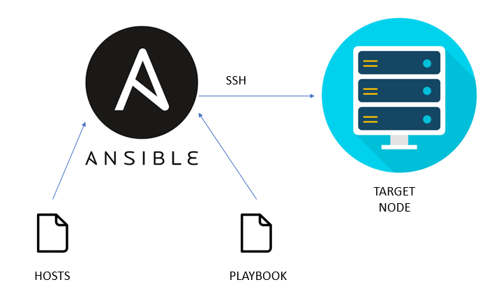

# Ansible Practice



## Table of Contents:
- Introduction 
- Installation 
- Configuration 
- Basic Usage 
- Roles in Ansible 
- Conclusion  
## Introduction:
Ansible is an open-source automation tool used for IT tasks such as configuration management, application deployment, and task automation. It is agentless, which means it does not require any software to be installed on the nodes it manages, relying instead on SSH for communication.


## Installation:
Prerequisites:

- Python 3.6 or later
- SSH access to the target machines
## Installing Ansible on Linux:


- Update your system package index:
```
sudo apt update   # For Debian/Ubuntu-based systems
sudo yum update   # For Red Hat/CentOS-based systems
```
- Install Ansible:
     For Debian/Ubuntu-based systems:

```
sudo apt install ansible
```
  For Red Hat/CentOS-based systems:

```
sudo yum install ansible
```
- Verify the installation:
```
ansible --version
```
## Configuration
### Inventory File
Ansible uses an inventory file to manage and organize your servers. By default, this file is located at `/etc/ansible/hosts`.

**Example Inventory File**

```
[webservers]
192.168.29.62
centosS1  ansible_host= 192.168.29.62

[dbservers]
db1.example.com
db2.example.com
```
### Ansible Configuration File
Ansible's main configuration file is `ansible.cfg`. You can create it in your project directory to override the default settings.

**Example **`**ansible.cfg**`** **

```
[defaults]
inventory = ./hosts
remote_user = your_user
```
## Basic Usage
### Ad-Hoc Commands
Ad-hoc commands are used for quick, one-time tasks.

```
ansible all -m ping
```
### Playbooks
Playbooks are Ansible's configuration, deployment, and orchestration language. They are written in YAML.

```
---
- name: Install and start Apache
  hosts: webservers
  become: yes

  tasks:
    - name: Install Apache
      apt: name=apache2 state=present
      when: ansible_os_family == "Debian"

    - name: Ensure Apache is running
      service:
        name: apache2
        state: started
```
### Running Playbooks
```
ansible-playbook playbook.yml
```
## Roles in Ansible
Roles are a way to organize playbooks and manage reusable components. A role can include variables, tasks, files, templates, and handlers.

### Creating a Role
```
ansible-galaxy init <role_name>
```
### Directory Structure of a Role
```
<role_name>/
├── defaults
│   └── main.yml
├── files
├── handlers
│   └── main.yml
├── meta
│   └── main.yml
├── tasks
│   └── main.yml
├── templates
├── tests
│   ├── inventory
│   └── test.yml
└── vars
    └── main.yml
```
### Using Roles in Playbooks
```
---
- hosts: webservers
  roles:
    - role_name
```
## Conclusion
Ansible is a powerful automation tool that simplifies the management of servers and applications. By leveraging Ansible's capabilities, you can ensure consistency, efficiency, and scalability in your IT operations. This README provides a foundational guide to get started with Ansible, from installation to utilizing roles. For more advanced usage and customization, refer to the official Ansible documentation.


